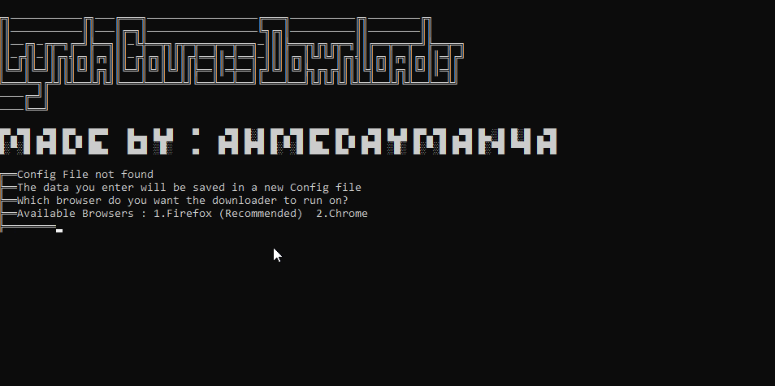
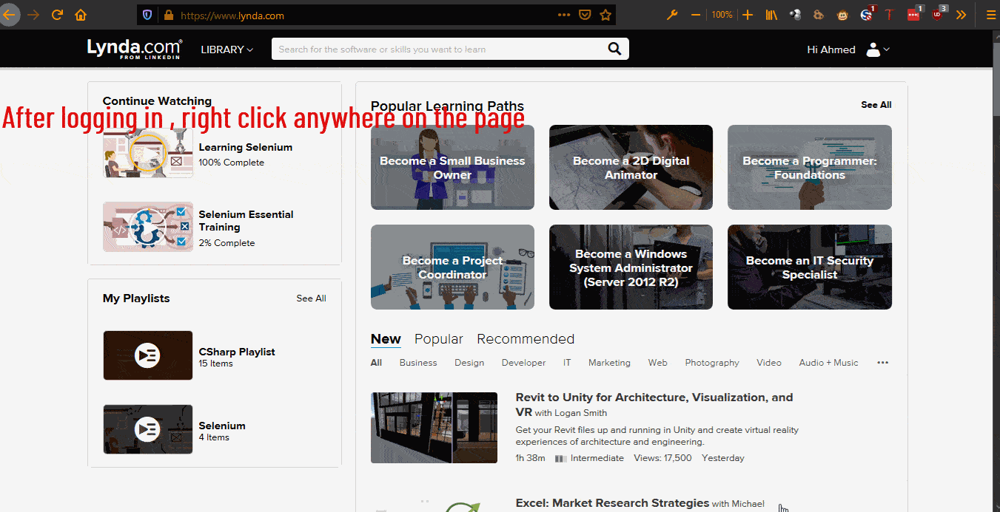
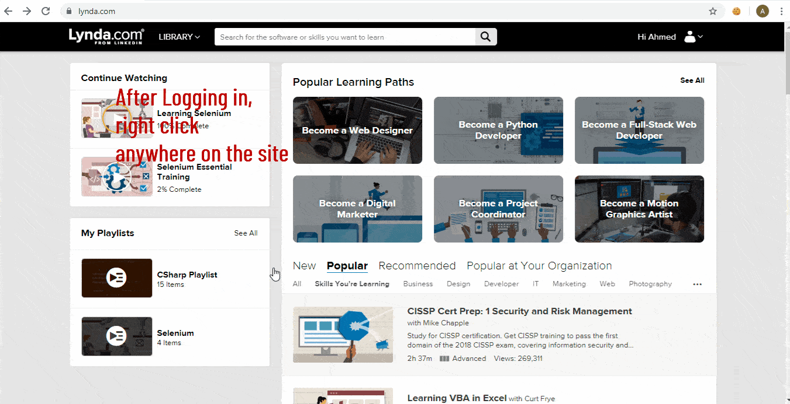

# Lynda Courses Downloader 
> Download lynda.com courses with the video quality you like.

## Why use this lynda downloader?
* The only Lynda Courses Downloader with a GUI as I couldn't find any other working ones
* Easy to use
* Cross platform
* Download in the video quality you like
* Doesn't need the lynda desktop app
* Download Exercise files will be added soon
* Upload directly to google drive will be added soon

## Easy install
Just go to the [releases section](https://github.com/ahmedayman4a/LyndaCoursesDownloader/releases), download the version that suits your platform and make sure you follow the requirements.

## Requirements
This program needs geckodriver or chromedriver to be present in the same directory as LyndaCoursesDownloader. The latest version of geckodriver and chromedriver at the time of release is already present which you can download from [here](https://github.com/ahmedayman4a/LyndaCoursesDownloader/releases) so you don't need to do anything if you have the latest version of firefox or Firefox version 60 and up.

* If you have Firefox installed , you don't need to do anything as geckodriver v0.26.0 should be supported by most upcoming versions.[More Info](https://firefox-source-docs.mozilla.org/testing/geckodriver/Support.html).

* If you have Chrome installed you will need to download the chromedriver which supports your browser version from [here](https://sites.google.com/a/chromium.org/chromedriver/downloads). This is one of the reasons firefox is recommended. You can check your chrome version by going to "Settings" then click on "About Chrome". Old versions of chrome are not recommended.

**Chrome or Firefox needs to be installed in their default location**
## How to use
* #### Windows
  Just run the Setup file. A shortcut will be added to your desktop and start menu
* #### Linux
  Open a terminal in the directory of the LyndaCoursesDownloader program then type : 

        chmod 777 ./LyndaCoursesDownloader
   and to run the program type:

        ./LyndaCoursesDownloader

## Getting the lynda authentication token cookie
* #### Firefox
  1. Press `Shift+F9` on your keyboard **OR** right click anywhere on the Lynda website , choose "Inspect Element" and click storage.
  2. Look for the word "token" the column "Name". Copy the value and paste it in the LyndaCoursesDownloader program.
  
* #### Google Chrome
  1. Right click anywhere on the page and click inspect element **OR** press `F12` on your keyboard
  2. Click on the 2 arrows in the top right corner beside the word performance then click Application
  3. Double click on the word "cookies" then click on www.lynda.com
  4. Look for the word "token" the column "Name". Copy the value and paste it in the LyndaCoursesDownloader program.
  
## Any Questions? Issues? Recommendations?
Just create an [issue](https://github.com/ahmedayman4a/LyndaCoursesDownloader/issues/new/choose) and I will reply as soon as I can.
## Acknowledgments
* Progress bar from [ShellProgressBar Project](https://github.com/Mpdreamz/shellprogressbar) 
